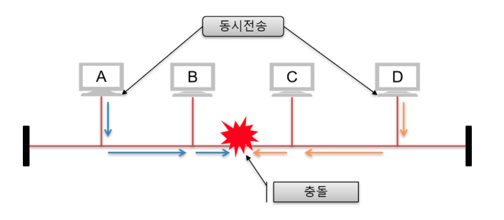
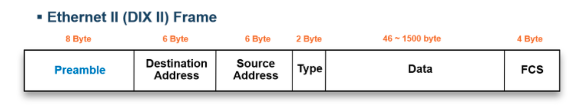

# 2계층 (데이터 링크 계층)

## 2계층에서 하는 일

### 2계층의 기능

- 2계층은 하나의 네트워크 대역. 즉, 같은 네트워크 상에 존재하는 여러 장비들 중에서 어떤 장비가 어떤 장비에게 보내는 데이터를 전달
- 추가적으로 오류제어, 흐름 제어 수행
- 흐름제어 - 누가 누구에게 데이터를 보내는지
- 오류제어 - 보내는 데이터에 오류가 있나 없나 체크하는 것

### 2계층의 네트워크 크기

- 2계층은 하나의 네트워크 대역 LAN에서만 통신 할 때 사용한다.
- 다른 네트워크와 통신할 때는 항상 3계층이 도와주어야한다.
- 3계층의 주소와 3계층의 프로토콜을 이용해야만 다른 네트워크와 통신이 가능하다.

## 2계층에서 사용하는 주소

### 물리적인 주소 (MAC 주소)

- LAN에서 통신할 때 사용하는 MAC 주소
- 물리적 주소 : 앞에는 OUI, 뒤에는 고유번호
- OUI : IEEE에서 부여하는 일종의 제조회사 식별 ID
- 고유번호 : 제조사에서 부여한 고유번호

## 2계층의 프로토콜

### 2계층 프로토콜의 종류

1. LAN에서 사용하는 프로토콜: Ethernet, Token-ring, FDDI ...
2. WAN에서 사용되는 Protocol: PPP, HDLC, Frame-relay ...

### 이더넷(Ethernet)

#### Ethernet 특징

- LAN 환경에서 사용하는 대표적인 프로토콜
- 데이터 통신 발생 시 즉시 데이터링크에 접근하여 통신을 시도하는 랜덤 엑세스 방식으로 동작 -> 구축 및 유지보수가 간편
- 회선을 공유하는 다중 접속 환경에서 다른 장비의 통신 데이터와 충돌하는 문제가 발생하여 대규모 네트워크로 구축하기엔 힘듦 -> 충돌을 최소화하기 위해 데이터링크에서는 매체접근제어(MAC)을 위해 CSMA/CD 기능을 사용

#### Ethernet Header

| Header         | Description  |
|---------------------|-------|
| Preamble            | Frame 앞에 붙는 제어신호로 헤더의 시작 위치를 정화히 하기 위해 사용한다.|
| Destination address | 목적지 MAC address를 표기한다. |
| Source address      | 출발지 MAC address를 표기한다. |
| Type                | 상위계층의 프로토콜을 표기한다. (IP, ARP 등) |
| FCS                 | Frame Check Sequence의 약자로 데이터 오류를 확인하기 위한 값을 표기한다. |

