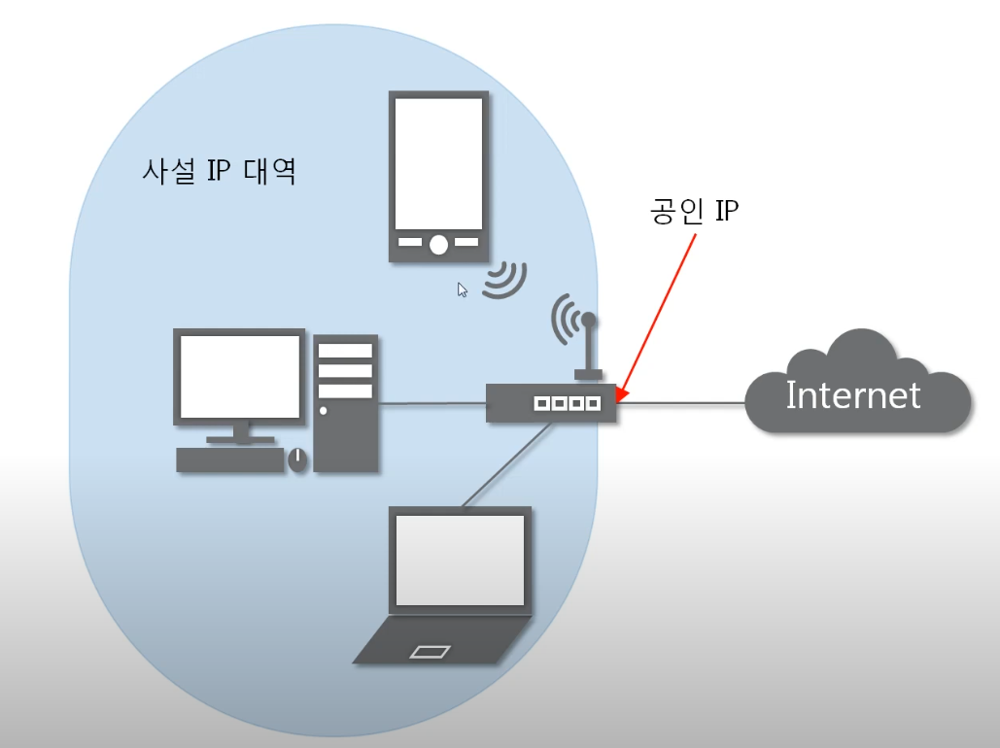

# 3계층 네트워크 모델
- 서로 다른 LAN 대역을 연결 (WAN)
- IPv4, IPv6, ARP, IGMP, ICMP 등

# IP Address

- 3계층 네트워크
- IPv4: 현재 PC에 할당된 IP주소
- 서브넷 마스크: IP주소에 대한 네트워크의 대역을 규정
- 게이트웨이 주소: 외부와 통신할 때 사용하는 네트워크의 출입구
- 10진수 숫자(0~255) 4개의 필드로 구성. 필드당 1byte

# Classful IP Address

- 네트워크 대역을 필드 단위로 구분
- 예를 들어, Class B의 경우 첫 번째, 두 번째 필드가 NET ID를 표현하고 나머지 두 개 필드가 해당 네트워크 대역에 속한 HOST ID를 표현하게 된다.

- Classful IP Address는 낭비되는 HOST ID가 많아진다.
- 예를 들어, Class C의 경우 하나의 네트워크 대역당 256개의 HOST ID를 가질 수 있는데, 실생활에서 하나의 네트워크 대역에 이렇게 많은 HOST를 이용하는 경우는 드물다. Class C가 HOST ID를 그나마 가장 적게 갖는다는 점을 감안하면 실제로 낭비되는 HOST ID는 엄청나게 많아진다. 

# Classless IP Address
- Classful IP Address의 HOST ID 낭비를 개선하기 위해 나온 방식
- 서브넷 마스크를 통해 네트워크 대역을 구분
  - 서브넷 마스크를 2진수로 표현하면, `11111111.11111111.11111111.11000000`와 같이 네트워크 대역을 표현하는 1과 HOST ID를 표현하는 0으로 이루어진다.
  - 따라서, 필드 단위로 네트워크 대역을 구분하는 Classful IP Address와는 달리 더 많은 네트워크 대역을 만들 수 있고 낭비되는 HOST ID가 줄어든다.

# 공인 & 사설 IP 주소

- 현재 많이 쓰이는 IP 주소 할당 시스템으로, 클래스리스 IP와 더불어서 함께 쓰인다.
- **공인 IP:** 인터넷상에 있는 수많은 외부 네트워크와 통신하기 위해 쓰이는 '공적' 주소.
- **사설 IP:** 하나의 LAN 네트워크 안에 속해있는 장비들끼리 통신하기 위해 쓰이는 '사적' 주소.

## 한 네트워크 안의 장비들은 모두 하나의 공인 IP를 공유하게 된다.

모든 **개인 네트워크 장비**들은 (컴퓨터, 노트북, 스마트폰 등...) 각자 **사설 IP**를 가지고 있다. 하지만 각각의 장비가 인터넷상의 외부 네트워크와 통신을 통해 데이터를 받아오고자 할때, 사설 IP는 **공인 IP로 변환**이 된다.

**공인 IP**를 소유하는 것은 각각의 장비들을 한 네트워크로 묶어주는 장비로, **라우터** 등이 되겠다. 공유기는 개인 장비에게서 요청을 전달받아, 대신해서 외부 인터넷으로 요청을 보내주는 역할을 한다고 볼 수 있다.

한마디로, 하나의 LAN 네트워크 안에 속해있는 모든 장비들은, 하나의 **똑같은 공용 IP**를 이용해서 request를 내보내고 response를 전달받게 된다.

사설 IP가 공인 IP로 변환되게 해주는 것은 **NAT (Network Address Translation)** 기술이다.

인터넷 회사들이 소비자들에게 제공하는 것은 결국, 네트워크 안의 장비들이 공통으로 쓸 수 있는 하나의 공인 IP 주소라고 할 수 있다.

네이버에서 내 IP 주소를 확인할 수 있는데, 이때 나오는 IP 주소는 장비의 사설 IP가 아닌 네트워크의 공인 IP이다. 즉 같은 공유기에 연결되어 있는 장비는 모두 같은 결과를 표시한다.

## 그렇다면 원래 어떤 장비가 요청을 보냈는지 어떻게 알 수 있나요?

- 라우터가 네트워크내의 개인 장비에게서 요청을 받아 인터넷상으로 내보낼때, 그 장비의 정보 즉 사설 IP 주소를 **NAT 테이블**에 기록한다.
- 외부 네트워크는 (네이버 등) 라우터가 보낸 요청을 받아 처리한 후, 라우터의 **공인 IP 주소로 응답을 보낸다**. 이때 외부 네트워크는 원래 요청자의 사설 IP 주소는 알지 못한다.
- 응답이 라우터에 도착하면 라우터는 NAT 테이블에서 원래 요청이 어떤 장비에게서 왔는지 조회한 후에 그 **장비에게 응답을 전달**해준다.

## 장점!

- 문제가 되었던 **IP 주소 부족현상**을 많이 해결한다. 인터넷상의 모든 장비가 다른 인터넷상의 모든 장비의 주소를 알 필요가 없게 된다. 그래서 사설 IP주소는 하나의 LAN 네트워크 안에서만 고유한 값을 가지면 된다.
- 공적으로 다른 네트워크들에게 보여지는 공인 IP주소만 고유값을 가지면 되기 때문에, 필요한 고유 IP주소의 숫자는 많이 줄어들게 된다.

## 서버 & 클라이언트

**웹서버**는 보통 요청을 보내는 쪽이 아닌, 클라이언트로부터 요청을 받아서 그에 맞는 응답을 돌려보내주는 역할을 한다. 만약 웹서버가 사설 IP 주소를 갖게 된다면, 공인 IP 소유자 즉 라우터는 일방적으로 들어오는 요청을 웹서버에 전달하지 못할 것이다. 웹서버측에서 요청을 보낸 기록이 남아있지 않기 때문이다. 

그래서 웹서버는 보통 **자체 공인 IP 주소**를 갖는다.

반면에 인터넷상에 요청을 보내고 응답을 받는 **클라이언트 장비**들은 보통 **사설 IP주소**를 이용하게 된다.  컴퓨터, 핸드폰, tv 등... 라우터를 통해 요청을 보내고, 라우터를 통해 응답을 전달받는다.

사설 IP 주소를 갖는 개인장비는 보통 **외부 네트워크에서 엑세스할 수 없다** (요청 불가). 사설 주소는 인터넷상에 공개되어 있지 않기 때문이다. 하지만 라우터 세팅에서 '포트 포워딩'이라는 기능을 사용하면 가능하다.

## 특수 IP 주소

### 0.0.0.0

'와일드카드' 라고 불리기도 한다.

실제로 있는 주소가 아닌, **'나머지 모든 IP주소'**라는 개념을 추상적으로 나타내는 것으로, 네트워크 설정값 등에서 사용되어진다.

### 127.0.0.1~

이것 또한 실제로 있는 주소가 아닌, '**현재 장비의 주소**'를 추상적으로 나타낸다. 네트워크 진단을 하거나 할때 로그기록 등에서 볼 수 있다.

### 게이트웨이 주소 (Gateway Address)

LAN 네트워크를 묶는 장비 즉 **라우터의 사설 IP 주소**를 나타내며, 라우터가 가지고 있는 공인 IP 주소와는 다르다.

네트워크내의 장비들이 보내는 요청은 먼저 이 게이트웨이 주소로 보내진다, 즉 라우터로 보내지는 것이다. 모든 요청이 결국 통과해야하는 '대문', 즉 게이트웨이 역할을 한다.

보통 네트워크내에서 사용가능한 가장 작은, 혹은 가장 큰 주소가 지정되어진다.

## 인터넷이 잘 되려면...

세가지 주소가 있어야 한다.

1. IP 주소 (장비의 사설 IP)
2. 서브넷 마스크 
3. 게이트웨이 주소
4. 그밖에... DNS 서버 주소: 웹상의 숫자로 되어있는 IP 주소를 도메인 문자열로 변환해준다.
