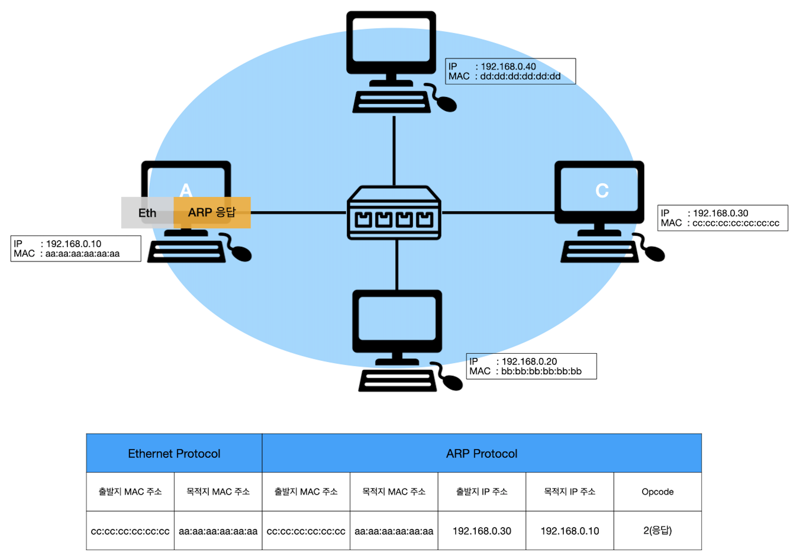

# ARP 프로토콜

## ARP 프로토콜이란?

- 주소 결정 프로토콜 (Address Resolution Protocol, ARP)은 네트워크 상에서 IP 주소를 MAC 주소로 대응시키기 위해 사용된다.
- ARP 프로토콜은 같은 네트워크 대역에서 통신을 하기 위해 필요한 MAC주소를 IP주소를 이용해서 알아오는 프로토콜이다.
- 같은 네트워크 대역에서 통신을 한다고 하더라도  데이터를 보내기 위해서는 7계층부터 캡슐화를 통해 데이터를 보내기 때문에 IP 주소와 MAC 주소가 모두 필요하다. 이 때 IP주소는 알고 MAC 주소는 모르더라도 ARP를 통해 통신이 가능하다.

## ARP Header

| Header                                | Description                                                  |
| :------------------------------------ | ------------------------------------------------------------ |
| Hardware type (4 byte)                | 2계층에서 사용하는 프로토콜의 종류 (주로 Ehternet 프로토콜: 0x0001)    |
| Protocol type (4 byte)                | 프로토콜 종류 (주로 IPv4: 0x0800)                             |
| Hardware Address Length (2 byte)      | MAC 주소의 길이 (0x06)                                        |
| Protocol Address Length (2 byte)      | IP 주소의 길이 (0x04)                                          |
| Opcode (4 byte)                       | 패킷의 유형, 요청일 경우 (0x001), 응답일 경우 (0x002)              |
| Source Hardware Address (6 byte)      | 출발지 MAC 주소                                              |
| Source Protocol Address (4 byte)      | 출발지 IP 주소                                               |
| Destination Hardware Address (6 byte) | 목적지 MAC 주소                                              |
| Destination Protocol Address (4 byte) | 목적지 IP 주소                                               |

## ARP 동작 과정

1. 출발지는 MAC 주소를 알고자 하는 목적지 IP Address를 지정해 패킷을 송신
2. IP 프로토콜이 ARP 프로토콜에게 ARP프로토콜에게 ARP Request 메세지를 생성하도록 요청
3. 메세지는 데이터링크 계층으로 전달되고 이더넷 프레임으로 Encapsulation됨
4. 모든 호스트와 라우터는 프레임을 수신 후 자신의 ARP 프로토콜에게 전달
5. 목적지 IP Address가 일치하는 시스템은 자신의 물리 주소를 포함하고 있는 ARP Reply 메세지를 보냄
6. 최초 송신 측은 지정한 IP Address에 대응하는 물리 주소를 획득 및 ARP 케시 테이블에 저장

### ARP 동작 예시

1. ARP요청을 보내기 위해서 표와 같이 header를 채우고 스위치로 패킷을 보냄

2. Ethernet Protocol의 목적지 MAC 주소가 브로드 캐스트이기 때문에 스위치에 연결된 모든 장비로 패킷을 보냄

3. 패킷을 받은 장비들은 캡슐을 까서 자신의 IP주소로 왔는지 확인함

4. 목적지 IP 주소가 일치하지 않으면 패킷을 폐기

5. 목적지 IP 주소가 일치하면 ARP 응답 패킷을 만들어서 A로 보냄(출발지 MAC 주소에 현재 장비의 MAC 주소를 넣어서 보냄으로써 요청을 보낸 A는 C의 MAC 주소를 확인할 수 있음)

6. 스위치를 통해 A로 패킷이 넘어감

7. 패킷을 까서 목적지의 MAC 주소를 ARP 캐시테이블에 넣음

