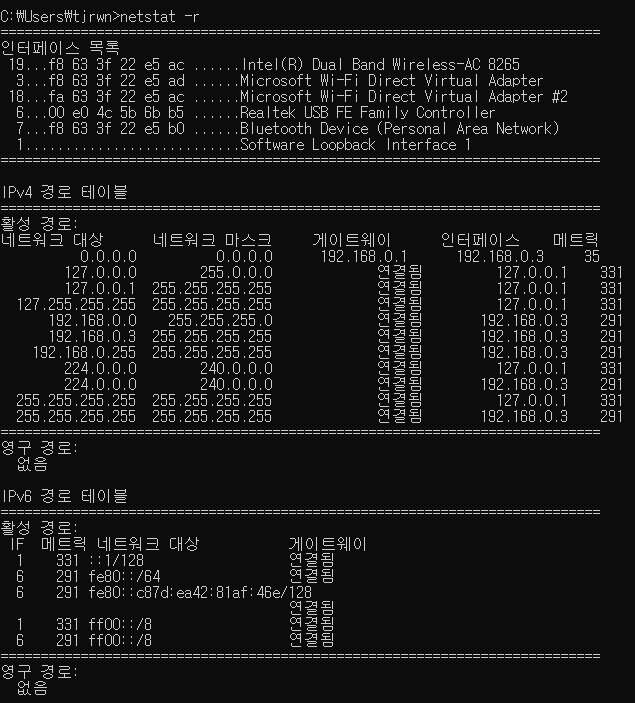
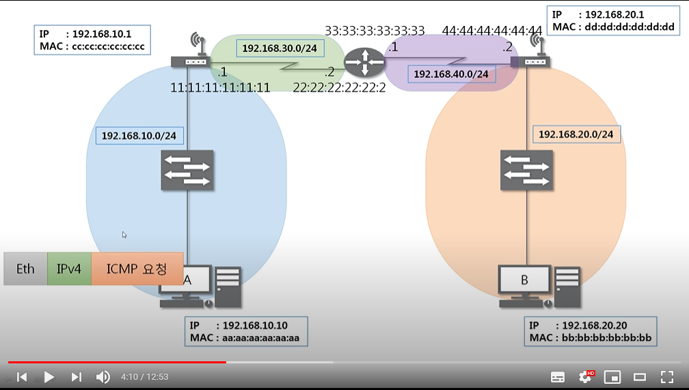

# Routing Table
- 다른 네트워크 주소를 찾아갈 때 사용하는 최적의 경로를 저장해 놓는 지도
- AS (Autonomous) : 하나의 네트워크 관리자에 의해서 관리되는 라우터들의 집단
- 특정 AS 내부에서 사용하는 라우터들은 해당 AS 내의 라우터들에 대한 정보만 기록
- 외부 AS에 대한 정보가 필요할 때는 ASBR(Autonomous System Boundary Router) 문지기 라우터에게 정보를 요청

- 외부 네트워크 대역과 통신하는 경로
  - 네트워크 주소가 0.0.0.0
  - 게이트웨이 주소 설정 
 

- 네트워크 대역 간 이동할 때마다 이더넷 프로토콜을 새로 작성
  - 각 장비에 도착할 때 마다 이더넷 프로토콜 내의 출발지,도착지 MAC 주소가 바뀌기 때문에
  - 이 때, 최종 목적지 주소와 라우팅 테이블의 주소를 비교하여 다음 목적지 주소를 알아냄
