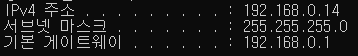

# 3계층 네트워크 모델
- 서로 다른 LAN 대역을 연결 (WAN)
- IPv4, IPv6, ARP, IGMP, ICMP 등

# IP Address

- 3계층 네트워크
- IPv4: 현재 PC에 할당된 IP주소
- 서브넷 마스크: IP주소에 대한 네트워크의 대역을 규정
- 게이트웨이 주소: 외부와 통신할 때 사용하는 네트워크의 출입구
- 10진수 숫자(0~255) 4개의 필드로 구성. 필드당 1byte

# Classful IP Address

- 네트워크 대역을 필드 단위로 구분
- 예를 들어, Class B의 경우 첫 번째, 두 번째 필드가 NET ID를 표현하고 나머지 두 개 필드가 해당 네트워크 대역에 속한 HOST ID를 표현하게 된다.

- Classful IP Address는 낭비되는 HOST ID가 많아진다.
- 예를 들어, Class C의 경우 하나의 네트워크 대역당 256개의 HOST ID를 가질 수 있는데, 실생활에서 하나의 네트워크 대역에 이렇게 많은 HOST를 이용하는 경우는 드물다. Class C가 HOST ID를 그나마 가장 적게 갖는다는 점을 감안하면 실제로 낭비되는 HOST ID는 엄청나게 많아진다. 

# Classless IP Address
- Classful IP Address의 HOST ID 낭비를 개선하기 위해 나온 방식
- 서브넷 마스크를 통해 네트워크 대역을 구분
  - 서브넷 마스크를 2진수로 표현하면, `11111111.11111111.11111111.11000000`와 같이 네트워크 대역을 표현하는 1과 HOST ID를 표현하는 0으로 이루어진다.
  - 따라서, 필드 단위로 네트워크 대역을 구분하는 Classful IP Address와는 달리 더 많은 네트워크 대역을 만들 수 있고 낭비되는 HOST ID가 줄어든다.
