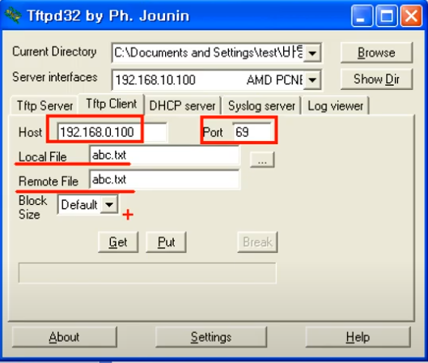

# UDP Protocol (Lv 4)
- User Datagram Protocol, 또는 Universal Datagram Protocol
- **비연결지향형** - 데이터가 교환되기 전에 컴퓨터 사이에 공식 연결이 성립되지 않는다.
    - UDP 패킷은 '데이터그램'이라고 칭한다.

### UDP는 TCP보다 빠르지만 안정성이 떨어진다.

- TCP 통신에서는 'handshake'라는 과정을 통해 먼저 연결을 성립한 후에 데이터 통신을 시작한다. UDP에서는 이런 과정없이 바로 데이터를 보내버린다.
- TCP는 패킷이 어떤 순서로 도착해야하는지 명시를 하고, 또 제대로 도착했는지 확인하는 기능이 있어서 패킷이 유실되었을 경우 재요청을 보낸다. UDP는 이런 기능 없음.
- 즉 데이터의 도착순서가 바뀌거나, 중복되거나, 누락될 수 있다.
- DDos 공격에 취약. 공식 연결없이 데이터를 마구잡이로 보낼 수 있기 때문에.

### 오류의 검사와 수정이 필요없는 프로그램에서 사용.

- UDP를 쓰는 프로그램은 이런 오류, 데이터 손실, 중복등을 감안하며 UDP의 **빠른 속도**를 최대로 이용할 수 있는 프로그램.
- DNS 서버, 스트리밍 서비스 등.

# 구조

- 출발지 포트번호
- 도착지 포트번호
- 길이: UDP header + 페이로드 (데이터)
- Checksum: UDP header 정보에 대한 백업.

## UDP가 사용되는 곳들

---

데이터가 최대한 빨리 도착해야하는 어플리케이션에서 사용된다. 정확성보다 속도.

### DNS 서버

DNS 서버는 유저가 웹사이트의 도메인 주소를 입력하면 해당하는 IP 주소를 반환해주는 기능을 한다. 효율성/속도를 위해 UDP 사용.

### 비디오/오디오 스트리밍

- 인터넷 전화: 전화에선 보통 통화품질이 최상이지만 속도가 매우 느린 것보다 잡음이 조금 있어도 속도가 빠른게 선호되기 때문에, UDP가 적합하다.
- 비디오 스트리밍 서비스: 프레임이 조금 유실되어도 사용자가 알아보기 힘들고 빠른 재생이 우선시되기 때문에 UDP가 적합하다.
- 보통 UDP & TCP를 섞어 쓴다.

### 온라인 게임

- 빠른 반응 속도가 중요.

### RIP Protocol

라우터들간 정보를 교환해서 자동으로 세팅을 할 수 있다.

### TFTP Server

호스트에서 클라이언트로 파일 전송. TFTPD라는 프로그램을 사용할 수 있다.

- 보내는 컴퓨터를 서버로 설정, 받는 컴퓨터를 클라이언트로 설정.

    

- 클라이언트는 서버의 IP주소와 포트 넘버를 설정해준다.

    

- 하지만 파일 전송엔 데이터 유실의 가능성 때문에 적합하지 않다. 꼭 필요한 상황에서 쓴다. 예) 컴퓨터들끼리 파일을 전송받아 OS를 설치할 경우.