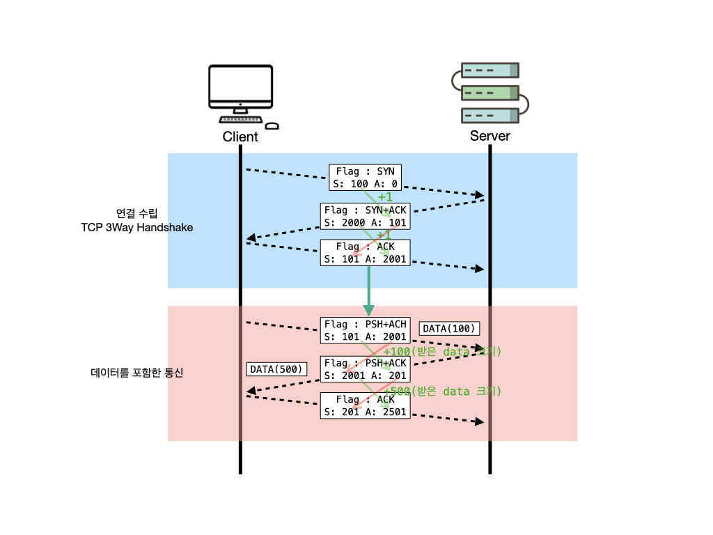
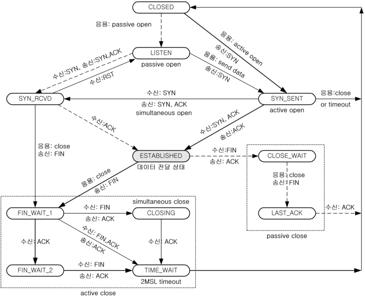
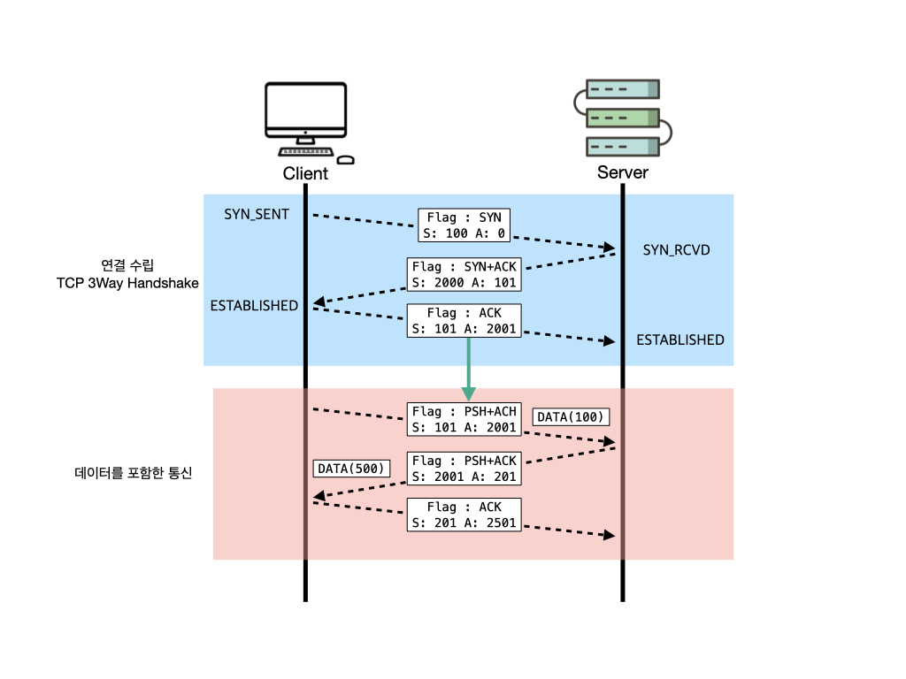

# TCP 프로토콜

## TCP 데이터 송수신 과정

TCP를 이용한 데이터 통신을 할 때 단순히 TCP 패킷만을 캡슐화해서 통신하는 것이 아닌 페이로드를 포함한 패킷을 주고 받을 때의 일정한 규칙

1. 보낸 쪽에서 또 보낼 때는 SEQ 번호와 ACK 번호가 그대로다.
2. 받는 쪽에서 SEQ 번호는 받은 ACK 번호가 된다.
3. 받는 쪽에서 ACK 번호는 받은 SEQ 번호 + 데이터의 크기

## TCP 상태전이도

다양한 상태들이 있지만 중요하게 봐야하는 것은 아래 두 가지이다.

1. LISTEN - 포트 번호를 열어놓고 있는 상태 (포트번호를 프로그램이 사용하고 있는 상태), 서버가 듣고 있는 상태
2. ESTABLISHED - 연결 수립이 된 상태

