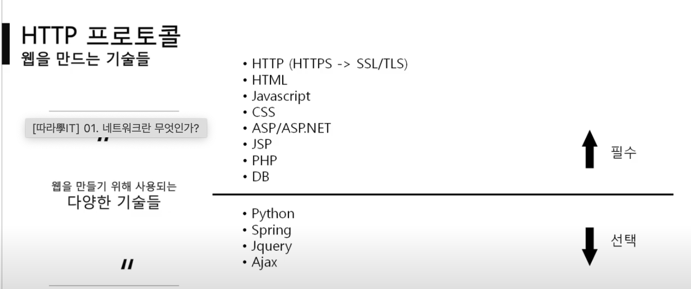
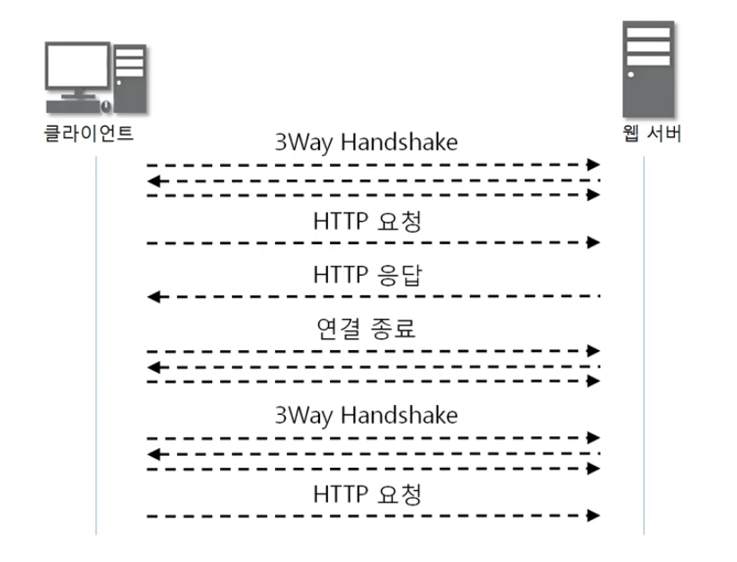

# 7계층 프로토콜: http
-7계층 프로토콜은 여러가지
-웹서비스를 통신 할 때는 http 프로토콜 사용
-바이트 단위로 살펴볼 필요없고, 틀만 이해하면 됨

-웹 만드는 기술들(가장 기본적인 것만 있음)

-html, js, css (웹표준, 클라이언트에서 동작하는 코드, 클라이언트가 바꿀수 있음, 저장은 서버에 되어 있어서 받아와서 사용하는데 이 과정에서 사용하는 것이 http) => 프론트엔드 개발자
-asp/asp.net, jsp, php (서버에서 실행되는 코드, 결과만 받아옴) => 백엔드 개발자
	-asp는 한국에서 잘 안씀 (ms에서 만듦)
	-jsp는 자바 기반임 (공공기관 홈페이지는 대부분 이거)
	-php는 자금이 좀 부족할 때 쓰는 경향

## HTTP 프로토콜
-HyperText Transfer Protocol
-www에서 쓰이는 핵심 프로토콜로 문서 전송을 위해 쓰이며 오늘날 거의 모든 웹 애플리케이션에서 사용
-요청/응답에 기반하여 서비스 제공

-http 1.0 => 초기 버전 // 네트워크 부하가 심하며 비효율적임. 이걸 수정한 것이 http 1.1
