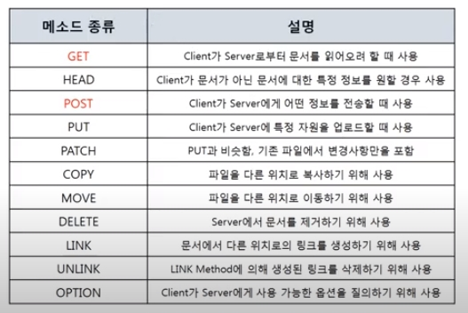

# 7계층 프로토콜: http

    -7계층 프로토콜은 여러가지
    -웹서비스를 통신 할 때는 http 프로토콜 사용
    -바이트 단위로 살펴볼 필요없고, 틀만 이해하면 됨

-웹 만드는 기술들(가장 기본적인 것만 있음)

    -html, js, css (웹표준, 클라이언트에서 동작하는 코드, 클라이언트가 바꿀수 있음, 저장은 서버에 되어 있어서 받아와서 사용하는데 이 과정에서 사용하는 것이 http) => 프론트엔드 개발자
    -asp/asp.net, jsp, php (서버에서 실행되는 코드, 결과만 받아옴) => 백엔드 개발자
    	-asp는 한국에서 잘 안씀 (ms에서 만듦)
    	-jsp는 자바 기반임 (공공기관 홈페이지는 대부분 이거)
    	-php는 자금이 좀 부족할 때 쓰는 경향

## HTTP 프로토콜

    -HyperText Transfer Protocol
    -www에서 쓰이는 핵심 프로토콜로 문서 전송을 위해 쓰이며 오늘날 거의 모든 웹 애플리케이션에서 사용
    -요청/응답에 기반하여 서비스 제공

-http 1.0 => 초기 버전 // 네트워크 부하가 심하며 비효율적임. 이걸 수정한 것이 http 1.1

## HTTP 요청 프로토콜

- 요청하는 방식을 정의하고 클라이언트의 정보를 담는다
- 영어와 특수문자로 작성

## HTTP 요청 프로토콜의 구조

- Request Line : 빨간색 상자  
  
  

  - 요청 타입 : GET(Client가 Server한테 어떤 데이터를 보내달라고 요청하면서 데이터를 보낼 수 있다), POST(Client가 Server에게 어떤 정보를 전송할 때 사용하면서 요청할 수 있다)  
    -> COPY, MOVE, DELETE는 사용자가 임의로 서버의 데이터에 손상을 주지 못하게 서버 측에서 막아 놓는다  
    -> GET과 POST를 왜 나눠놨는가?

    - GET 방식은 데이터를 보낼 때 uri부분에 데이터를 포함시켜 보낸다(노출되어도 되는 데이터)
    - POST 방식은 데이터를 보낼 때 body부분에 데이터를 포함시켜 보낸다(중요한 데이터)

  - URI(Uniform Resource Identifier) : 인터넷상에서 특정 자원(파일)을 나타내는 유일한 주소
    
    - URI의 구조
      - 스키마 : http, https, ftp 등 7계층 프로토콜
      - 포트번호 : 지정하지 않고 웹 브라우저가 알아서 지정(80, 443)
      - 경로 : 원격지의 폴더 내에 파일을 지정
      - 쿼리 : 원하는 데이터를 전달하는 값

- Headers : 파란색 상자, 다양한 옵션을 나타냄
- 공백 : 초록색 상자, 한 줄의 공백을 표시
- Body : 주황색 상자, 어떤 데이터를 요청할 때 들어가는 값
