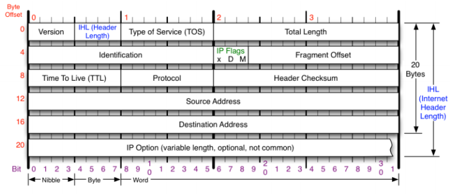
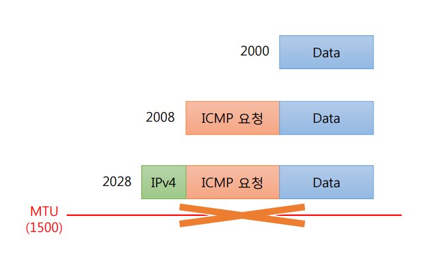
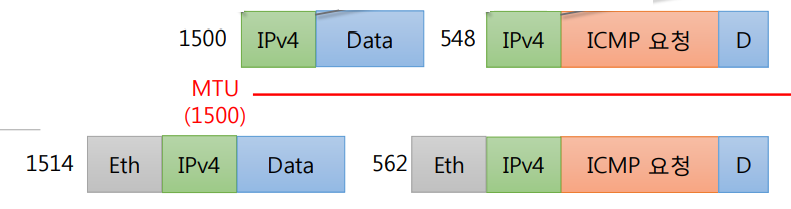

# IPv4의 조각화

    큰 ip 패킷들이 적은 MTU(Maximum Transmission Unit: 프레임의 최대 전달 단위)를 갖는 링크를 통하여 전송되려면 
    여러개의 작은 패킷으로 쪼개어 전송되어야 함 (MTU보다 클 경우 전송이 불가능)
    즉, 각 라우터마다 전송에 적합한 프레임으로 변환이 필요함.

ipv4는 발신지 뿐 아니라 라우터에서도 단편화 가능하지만, ipv6는 발신지에서만 단편화 가능. 
재조립은 항상 최종 수신지에서만 함

## 조각화를 위한 헤더의 필드들
* Flag
    - DF(Do not Flagment): 1 단편화를 하지 않음   0 단편화를 함
    - MF(More Fragment) : 0 추가적인 단편화된 파일 없음   1 추가적인 단편화된 파일 있음
* Flagment offset
    - 전체 데이터에서 단편에 포함된 데이터의 시작위치. 8바이트 단위로 표시

* Total length
	- 헤더와 데이터를 합한 길이
	- 데이터의 길이 = 전체 길이 -  헤더 길이

* Identification
    - 모든 단편화된 헤더에는 식별자 필드다 포함 됨
    - 데이터그램이 단편화되어 전송된후 재조립 할때 이용
    - 식별자는 중복되지 않아야 함

## 조각화에 대한 예시
Example1)

    1500MTU를 갖는 라우터에 이보다 큰 2000바이트의 데이터를 조각화를 하지않고 전송한 경우 전송이 되지 않음.

Example2)

    일반적으로 ipv4 헤더의 크기는 20byte ethernet	헤더의 크기는  14byte임 
    예를 들면, 1500MTU를 갖는 라우터를 통과 하기 위해서는 데이터를 1500바이트 미만으로 쪼개서 보내야 함. 
    거기에 ipv4헤더를 포함시켜서 보내야 하므로 데이터의 최대 크기는 1480 바이트. 
    라우터를 통과하면 라우터서 이더넷 헤더를 붙여서 전송하므로 수신지에서 받을때 패킷의 크기는 1514바이트가 됨
